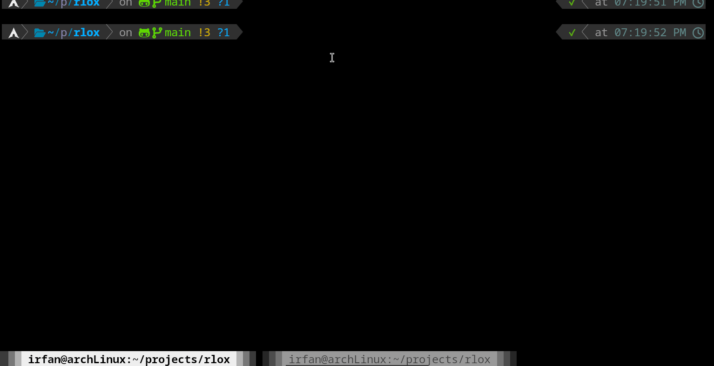
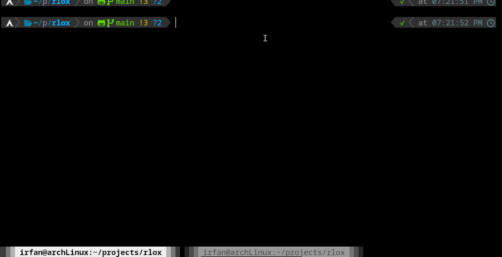

# A rust version of jlox programming language
The project is a rewrite of jlox,java interpreter of lox programming language from the book "Crafting interpreter"

The programming language can:
1. Declare variable(primitive type)
2. for loop
3. function declaration
4. function call
5. recusive function call

## Example

**Fig:Recursive fibbonachi function call and runtime calculation**

**Fig: for loop for summing values**

